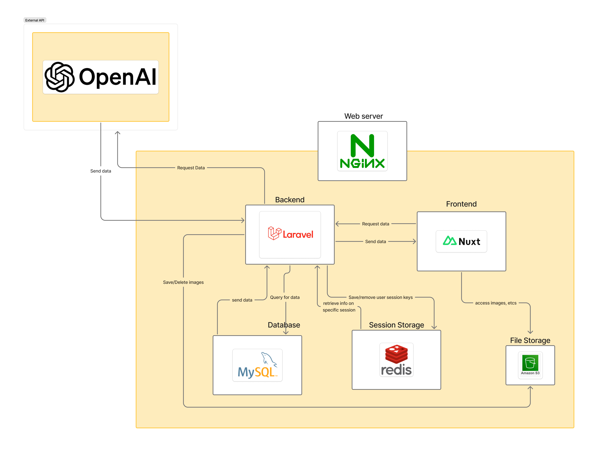
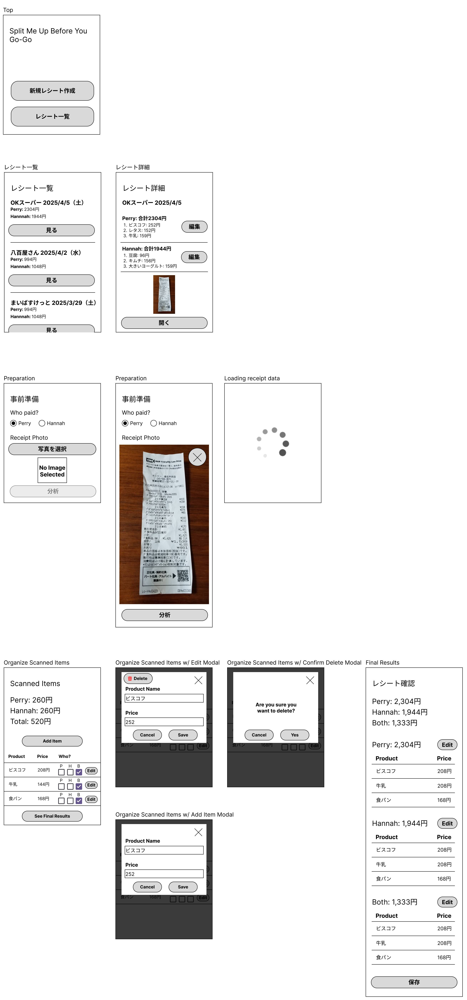

# Split My Receipt Up (Frontend)

※ [English README.md is here！](/docs/README-english.md)👈

## なぜ作ってるか
TODO

## 何を学びたいか
TODO

## 簡単なアーキテクチャ設計

## ワイヤーフレーム
- [figmaワイヤー](https://www.figma.com/design/5YJWfJxPOz41nTYUs3Ecsv/Split-Me-Up-Before-You-Go-Go?node-id=0-1&t=pg6lQGz4q81qqjrR-1)

## ローカル環境構築
TODO

## おすすめのツール・Extensionなど
TODO
